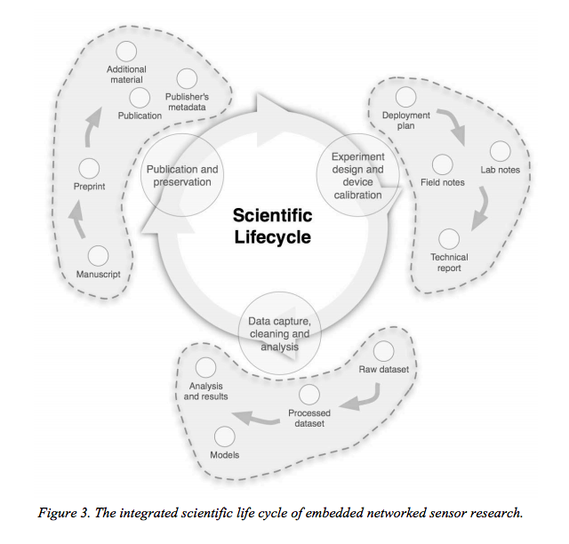

## Goals of this lesson:

- To teach FAIRer research data and software management and development practices
- Focus on practical approaches to being FAIRer admitting that there are no “silver bullets”

## Library services across the research lifecycle

Libraries actively help researchers navigate the requirements, demands, and tools that make up the research data management landscape, particularly when it comes to the organization, preservation, and sharing of research data and software. 

They play a vital role in directly supporting the academic enterprise by promoting data sharing and reproducibility. Through their research training and services, particularly for early career researchers and graduate students, libraries are driving a cultural shift towards more effective data and software stewardship. 

As a trusted partner, and with an embedded understanding of their communities, libraries foster collaboration and facilitate coordination between community stakeholders and are a critical part of the discussion. 

Pepe, A., Mayernik, M., Borgman, C.L. and Van de Sompel, H., 2010. [From artifacts to aggregations: Modeling scientific life cycles on the semantic web.](https://arxiv.org/abs/0906.2549?context=cs) Journal of the American Society for Information Science and Technology, 61(3), pp.567-582. arXiv: https://arxiv.org/abs/0906.2549?context=cs.

## FAIR in one sentence

The FAIR data principles are all about how machines and humans communicate with each other. They are not a standard, but a set of principles for developing robust, extensible infrastructure which facilitates discovery, access and reuse of research data and software.

## Where did FAIR come from?

The FAIR data principles emerged from a FORCE11 workshop in 2014. This was formalised in 2016 when these were published in Scientific Data: [FAIR Guiding Principles for scientific data management and stewardship](https://www.nature.com/articles/sdata201618). In this article, the authors provide general guidance on machine-actionability and improvements that can be made to streamline the findability, accessibility, interoperatbility, and reuability (FAIR) of digital assets.   

"as open as possible, as closed as necessary"

## FAIR brings all the stakeholders together

We all win when the outputs of research are properly managed, preserved and reusable. This is applicable from big data of genomic expression all the way through to the ‘small data’ of qualitative research. 

Research is increasingly dependent on computational support and yet there are still many bottlenecks in the process. The overall aim of FAIR is to cut down on the inefficient processes in research by taking advantage of linked resources and the exchange of data so that all stakeholders in the research ecosystem, can automate repetitive, boring, error-prone tasks.

## Examples of Library Services implementing the FAIR principles

  * If your local data repository shares metadata with other aggregators, it's F for Findable.
  * If you advocate for researchers to use ORCIDs and seek DOIs for research data outputs, it's F for Findable
  * If you r institution mints DOIs for research datasets... that's A for Accessible.
  * If your institutional data repository enables metadata for harvest by an aggregator, that's I for Interoperable.
  * If you provide advice and consultation services for choosing licences for research data, that's R for Reusable

## Further reading following this lesson

TIB Hannover has provided the following FAIR guide with examples:
[TIB Hannover FAIR Principles Guide](https://blogs.tib.eu/wp/tib/2017/09/12/the-fair-data-principles-for-research-data) 

FAIR Data Action Plan
https://github.com/FAIR-Data-EG/Action-Plan 

## How does “FAIR” translate to your institution or workplace?

Group exercise
Use an etherpad / whiteboard

* Does your institutional data management policy refer to FAIR principles?

* If you have a data management planning tool (eg DMP online) go through the mandatory fields and identify where there are FAIR teaching moments.

* Compile a list of research management tools that your institution provides access to and brainstorm examples where these tools embody the FAIR data principles.

* Use the [FAIR data self assessment tool] (https://www.ands.org.au/working-with-data/fairdata/fair-data-self-assessment-tool) to help frame your answers.
