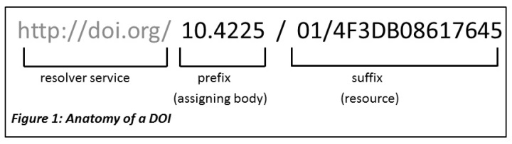
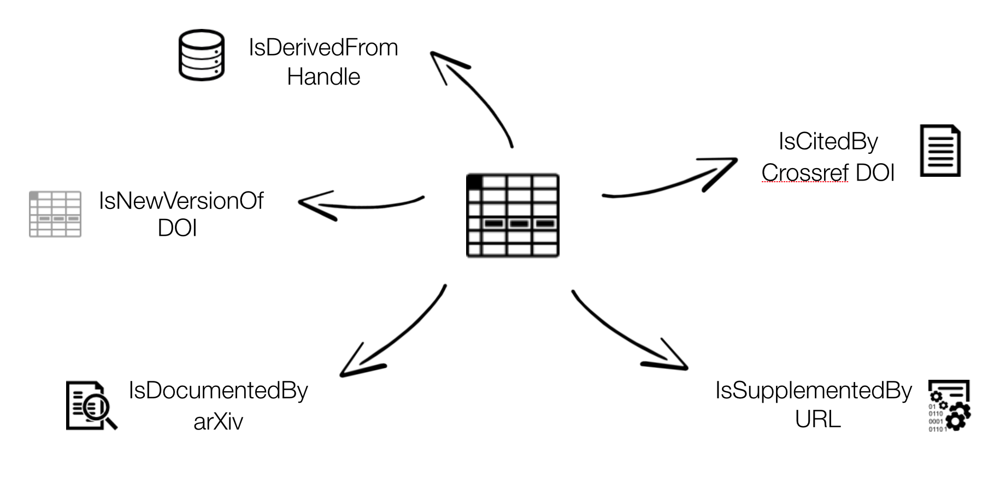

> ## For data & software to be findable:  
> F1. (meta)data are assigned a globally unique and eternally persistent identifier or PID  
> F2. data are described with rich metadata  
> F3. (meta)data are registered or indexed in a searchable resource  
> F4. metadata specify the data identifier  
{: .checklist}

## Persistent identifiers (PIDs) 101

A persistent identifier (PID) is a long-lasting reference to a (digital or physical) resource:

- Designed to provide access to information about a resource even if the resource it describes has moved location on the web
- Requires technical, governance and community to provide the persistence
- There are many different PIDs available for many different types of scholarly resources e.g. articles, data, samples, authors, grants, projects, conference papers and so much more

## Different types of PIDs

PIDs have community support, organizational commitment and technical infrastructure to ensure persistence of identifiers. They often are created to respond to a community need. For instance, the International Standard Book Number or ISBN was created to assign unique numbers to books, is used by book publishers, and is managed by the International ISBN Agency. Another type of PID, the Open Researcher and Contributor ID or ORCID (iD) was created to help with author disambiguation by providing unique identifiers for authors. The [ODIN Project identifies additional PIDs](https://project-thor.readme.io/docs/project-glossary) along with [Wikipedia's page on PIDs](https://en.wikipedia.org/wiki/Persistent_identifier).

## Digital Object Identifiers (DOIs)

The DOI is a common identifier used for academic, professional, and governmental information such as articles, datasets, reports, and other supplemental information. The [International DOI Foundation (IDF)](https://www.doi.org/) is the agency that oversees DOIs. [CrossRef](https://www.crossref.org/) and [Datacite](https://datacite.org/) are two prominent not-for-profit registries that provide services to create or mint DOIs. Both have membership models where their clients are able to mint DOIs distinguished by their prefix. For example, DataCite features a [statistics page](https://stats.datacite.org/) where you can see registrations by members.

## Anatomy of a DOI

A DOI has three main parts:

- Proxy or DOI resolver service
- Prefix which is unique to the registrant or member
- Suffix, a unique identifier assigned locally by the registrant to an object

 

In the example above, the prefix is used by the Australian National Data Service (ANDS) now called the Australia Research Data Commons (ARDC) and the suffix is a unique identifier for an object at Griffith... DataCite provides DOI [display guidance](https://support.datacite.org/docs/datacite-doi-display-guidelines
) so that they are easy to recognize and use, for both humans and machines.

> ## Challenge
> arXiv is a preprint repository for physics, math, computer science and related disciplines. 
> It allows researchers to share and access their work before it is formally published. 
> Visit the arXiv new papers page for [Machine Learning](https://arxiv.org/list/cs.LG/recent). 
> Choose any paper by clicking on the 'pdf' link next to it. Now use <kbd>control</kbd> + <kbd>F</kbd> or <kbd>command</kbd> + <kbd>F</kbd> and search for 'http'. Did the author use DOIs for their data and software?
> 
> > ## Solution
> > Authors will often link to platforms such as GitHub where they have shared their software and/or they will link to their website where they are hosting the data used in the paper. The danger here is that platforms like GitHub and personal websites are not permanent. Instead, authors can use repositories to deposit and preserve their data and software while minting a DOI. Links to software sharing platforms or personal websites might move but DOIs will always resolve to information about the software and/or data. See DataCite's [Best Practices for a Tombstone Page](https://support.datacite.org/docs/tombstone-pages).
> {: .solution}
{: .challenge}

## Rich Metadata

More and more services are using common schemas such as DataCite's Metadata Schema or [Schema.org](https://Schema.org) to foster greater use and discovery. A schema provides an overall structure for the metadata and describes core metadata properties. While DataCite's Metadata Schema is more general, there are discipline specific schemas such as [Data Documentation Initiative (DDI) and Darwin Core](https://en.wikipedia.org/wiki/Metadata_standard). 

Thanks to schemas, the process of adding metadata has been standardised to some extent but there is still room for error. For instance, DataCite [reports](https://blog.datacite.org/citation-analysis-scholix-rda/) that links between papers and data are still very low. Publishers and authors are missing this opportunity. 

Challenges:
Automatic ORCID profile update when DOI is minted
RelatedIdentifiers linking papers, data, software in Zenodo

## Connecting research outputs
DOIs are everywhere. Examples.

Resource IDs (articles, data, software, …)
Researcher IDs
Organisation IDs, Funder IDs
Projects IDs
Instrument IDs
Ship cruises IDs
Physical sample IDs,
DMP IDs…
videos 
images 
3D models 
grey literature

https://support.datacite.org/docs/connecting-research-outputs

Bullet points about the current state of linking...
https://blog.datacite.org/citation-analysis-scholix-rda/

## Provenance?
Provenance means validation & credibility – a researcher should comply to good scientific practices and be sure about what should get a PID (and what not).
Metadata is central to visibility and citability – metadata behind a PID should be provided with consideration.
Policies behind a PID system ensure persistence in the WWW - point. At least metadata will be available for a long time.
Machine readability will be an essential part of future discoverability – resources should be checked and formats should be adjusted (as far possible).
Metrics (e.g. altmetrics) are supported by PID systems.

## Rich Metadata
https://schema.datacite.org/

## Publishing behaviour of researchers 

According to:

Technische Informationsbibliothek (TIB) (conducted by engage AG) (2017): Questionnaire and Dataset of the TIB Survey 2017 on information procurment and pubishing behaviour of researchers in the natural sciences and engineering. Technische Informationsbibliothek (TIB). DOI: [https://doi.org/10.22000/54](https://doi.org/10.22000/54)

- responses from 1400 scientists in the natural sciences & engineering (across Germany)
- 70% of the researchers are using DOIs for journal publications
- less than 10% use DOIs for research data
-- 56% answered that they don’t know about the option to use DOIs for other publications (datasets, conference papers etc.) 
-- 57% stated no need for DOI counselling services
-- 40% of the questioned researchers need more information
-- 30% cannot see a benefit from a DOI

## Choosing the right repository

Ask your colleagues & collaborators
Look for institutional repository at your own institution

determining the right repo for your reseearch
data are kept safe in a secure environment
data are regularly backed up and preserved (long-term) for future use
data can be easily discovered by search engines and included in online catalogues
intellectual property rights and licencing of data are managed 
access to data can be administered and usage monitored
the visibility of data can be enhanced
enables more use and citation
citation of data increases researchers scientific reputation
Decision for or against a specific repository depends on various criteria, e.g.
Data quality 
Discipline
Institutional requirements
Reputation (researcher and/or repository)
Visibility of research
Legal terms and conditions
Data value (FAIR Principles)
Exit strategy (tested?)
Certificate (based only on documents?)

Some recommendations:
→ look for the usage of PIDs
→ look for the usage of standards (DataCite, Dublin Core, discipline-specific metadata
→ look for licences offered
→ look for certifications (DSA / Core Trust Seal, DINI/nestor, WDS, …)

Searching re3data w/ exercise
https://www.re3data.org/
Out of more than 2115 repository systems listed in re3data.org in July 2018, only 809 (less than 39 %!) state to provide a PID service, with 524 of them using the DOI system

Search open access repos
http://v2.sherpa.ac.uk/opendoar/

FAIRSharing
https://fairsharing.org/databases/

## Data Journals

Another method available to researchers to cite and give credit to research data is to author works in data journals or supplemental approaches used by publishers, societies, disciplines, and/or journals. 

Articles in data journals allow authors to:
- Describe their research data (including information about process, qualities, etc)
- Explain how the data can be reused
- Improve discoverability (through citation/linking mechanisms and indexing)
- Provide information on data deposit
- Allow for further (peer) review and quality assurance
- Offer the opportunity for further recognition and awards

Examples:
- [Nature Scientific data](https://www.nature.com/sdata/) - published by Nature and established in 2013
- [Geoscience Data Journal](https://rmets.onlinelibrary.wiley.com/journal/20496060) - published by Wiley and established in 2012
- [Journal of Open Archaeology Data](https://openarchaeologydata.metajnl.com/) - published by Ubiquity and established in 2011
- [Biodiversity Data Journal](https://bdj.pensoft.net/) - published by Pensoft and established in 2013.
- [Earth System Science Data](https://www.earth-system-science-data.net/) - published by Copernicus Publications and established in 2009

Also, the following study discusses data journals in depth and reviews over 100 data journals:
Candela, L. , Castelli, D. , Manghi, P. and Tani, A. (2015), Data Journals: A Survey. J Assn Inf Sci Tec, 66: 1747-1762. doi:[10.1002/asi.23358](https://doi.org/10.1002/asi.23358)

> ## How does your discipline share data
>
> Does your discipline have a data journal? Or some other mechanism to share data? For example, the American Astronomical Society (AAS) via the publisher IOP Physics offers a [supplment series](http://iopscience.iop.org/journal/0067-0049/page/article-data) as a way for astronomers to publish data. 
{: .discussion}

List recent publications re: benefits of data sharing / software sharing

Questions:
Is FAIRSharing vs re3data comparison slide from TIB findability slides needed here?
Should we include recent thread about handle system vs DOIs in IRs (costs)
Zenodo-GitHub linking is listed in another episode, right?
Include guidance for Google schema indexing...

Notes:  
Note about authors being proactive and working with the journals/societies to improve papers referencing data, software...

Tombstone
