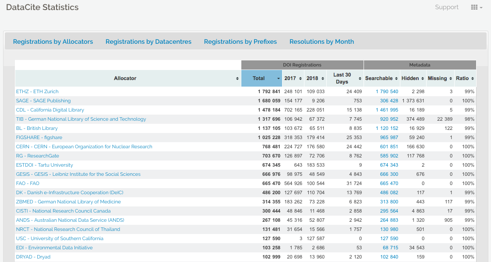

> ## For data & software to be accessible:
> A1.  (meta)data are retrievable by their identifier using a standardized communications protocol  
>     A1.1 the protocol is open, free, and universally implementable  
>     A1.2 the protocol allows for an authentication and authorization procedure, where necessary  
> A2. metadata remain accessible, even when the data are no longer available
{: .checklist}

## What is a protocol?
Simply put, it's an access method of exchanging data over a computer network.  Each protocol has its rules for how data is formatted, compressed, checked for errors. Research repositories often use the OAI-PMH or REST API protocols to interface with data in the repository. The following image from [TutorialEdge.net: What is a RESTful API by Elliot Forbes](https://tutorialedge.net/general/what-is-a-rest-api/) provides a useful overview of how RESTful interfaces work:

Zenodo offers a visual interface for seeing how formats such as DataCite XML will look like when requested for records such as the following record from the Biodiversity Literature Repository:  

[Formiche di Madagascar raccolte dal Sig. A. Mocquerys nei pressi della Baia di Antongil (1897-1898).](https://sandbox.zenodo.org/record/9785/export/dcite4#.W3eDVthKjGI)

Wikipedia has a list of [commonly used network protocols](https://en.wikipedia.org/wiki/Lists_of_network_protocols) but check the service you are using for documentation on the protocols it uses and whether it corresponds with the FAIR Principles. For instance, see [Zenodo's Principles](http://about.zenodo.org/principles/) page.

## Contributor information
Alternatively, for sensitive/protected data, if the protocol cannot guarantee secure access, an e-mail or other contact information of a person/data manager should be provided, via the metadata, with whom access to the data can be discussed. The [DataCite metadata schema](https://schema.datacite.org/) includes contributor type and name as fields where contact information is included. Collaborative projects such as [THOR](https://project-thor.readme.io/), [FREYA](https://www.project-freya.eu/en/resources), and [ODIN](https://odin-project.eu/project-outputs/deliverables/) are working towards improving the interoperability and exchange of metadata such as contributor information. 

## Author disambiguation and authentication
Across the research ecosystem, publishers, repositories, funders, research information systems, have recognized the need to address the problem of author disambiguation. The illustrative example below of the many variations of the name _Jens Åge Smærup Sørensen demonstrations_ the challenge of wrangling the correct name for each individual author or contributor:  
  

Thankfully, a number of research systems are now integrating ORCID into their authentication systems. Zenodo provides the login ORCID authentication option. Once logged in, your ORCID will be assigned to your authored and deposited works:  
 

 
## Exercise to create ORCID account and authenticate via Zenodo
 
## Understanding whether something is open, free, and universally implementable
ORCID features a principles page where we can assess where it lies on the spectrum of these criteria. Can you identify statements that speak to these conditions: open, free, and universally implemetable?
 
Answers:
- ORCID is a non-profit that collects fees from its members to sustain its operations
- [Creative Commons CC0 1.0 Universal (CC0)](https://tldrlegal.com/license/creative-commons-cc0-1.0-universal) license releases data into the public domain, or otherwise grants permission to use it for any purpose
- It is open to any organization and transcends borders
Challenge Questions:
- Where can you download the freely available data?
- How does ORCID solicit community input outside of its governance?
- Are the tools used to create, read, update, delete ORCID data open?

## Tombstones, a very grave subject

There are a variety of reasons why a placeholder with metadata or tombstone of the removed research object exists including but not limited to staff removal, spam, request from owner, data center does not exist is still, etc. A tombstone page is needed when data and software is no longer accessible. A tombstone page communicates that the record is gone, why it is gone, and in case you really must know, there is a copy of the metadata for the record. A tombstone page should include: DOI, date of deaccession, reason for deaccession, message explaining the data center's policies, and a message that a copy of the metadata is kept for record keeping purposes as well as checksums of the files. Zenodo offers us further [explanation of the reasoning behind tombstone pages](https://github.com/zenodo/zenodo/issues/160). 

DataCite offers [statistics](https://stats.datacite.org/) where the failure to resolve DOIs after a certain number of attempts is reported (see [DataCite statistics support page](https://support.datacite.org/docs/datacite-statistics)for more information). In the case of Zenodo and the GitHub issue above, the hidden field reveals thousands of records that are a result of spam.

If a DOI is no longer available and the data center does not have the resources to create a tombstone page, DataCite provides a generic [tombstone page](https://support.datacite.org/docs/tombstone-pages).

**See the following tombstone examples:**
- Zenodo tombstone: [https://zenodo.org/record/1098445](https://zenodo.org/record/1098445)
- Figshare tombstone: [https://figshare.com/articles/Climate_Change/1381402](https://figshare.com/articles/Climate_Change/1381402)

## Discussion of tombstones

## Lessons to teach in connection with this section and exercises
[Software Carpentry: Version Control with Git](https://swcarpentry.github.io/git-novice/) or [Library Carpentry: Intro to Git](https://librarycarpentry.github.io/lc-git/)
[Making your Code Citeable](https://guides.github.com/activities/citable-code/)
Does an exercise or lesson exist that we can point to involving Software Heritage?
