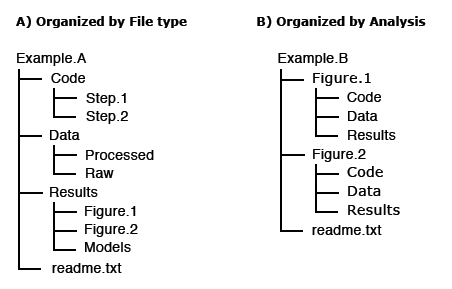

> ## For data & software to be reusable:
> R1. (meta)data have a plurality of accurate and relevant attributes  
>     R1.1 (meta)data are released with a clear and accessible data usage licence  
>     R1.2 (meta)data are associated with their provenance  
> R1.3 (meta)data meet domain-relevant community standards
{: .checklist}

## What does it mean to be machine readable vs human readable?

According to the [Open Data Handbook](http://opendatahandbook.org/glossary/en/):

*Human Readable*
"Data in a format that can be conveniently read by a human. Some human-readable formats, such as PDF, are not machine-readable as they are not structured data, i.e. the representation of the data on disk does not represent the actual relationships present in the data."

*Machine Readable*
"Data in a data format that can be automatically read and processed by a computer, such as CSV, JSON, XML, etc. Machine-readable data must be structured data. Compare human-readable.

Non-digital material (for example printed or hand-written documents) is by its non-digital nature not machine-readable. But even digital material need not be machine-readable. For example, consider a PDF document containing tables of data. These are definitely digital but are not machine-readable because a computer would struggle to access the tabular information - even though they are very human readable. The equivalent tables in a format such as a spreadsheet would be machine readable.

As another example scans (photographs) of text are not machine-readable (but are human readable!) but the equivalent text in a format such as a simple ASCII text file can machine readable and processable."

## File naming best practices
A file name should be unique, consistent and descriptive. This allows for increased visibility and discoverability and can be used to easily classify and sort files. Remember, a file name is the primary identifier to the file and its contents.  
### Do’s and Don’ts of file naming:
#### Do’s: 
- Make use of file naming tools for bulk naming such as Ant Renamer, RenameIT or Rename4Mac.
- Create descriptive, meaningful, easily understood names no less than 12-14 characters. 
- Use identifiers to make it easier to classify types of files i.e. Int1 (interview 1) 
- Make sure the 3-letter file format extension is present at the end of the name (e.g. .doc, .xls, .mov, .tif)
- If applicable, include versioning within file names
- For dates use the  ISO 8601  standard: YYYY-MM-DD and place at the end of the file number UNLESS you need to organise your files chronologically. 
- For experimental data files, consider using the project/experiment name and conditions in abbreviations 
- Add a README file in your top directory which details your naming convention, directory structure and abbreviations
- - When combining elements in file name, use common [special letter case](https://en.wikipedia.org/wiki/Letter_case#Special_case_styles) patterns such as Kebab-case, CamelCase, or Snake_case, preferably use hyphens (-) or underscores (_) 
#### Don’ts:
- Avoid naming files/folders with individual persons names as it impedes handover and data sharing. 
- Avoid long names
- Avoid using spaces, dots, commas and special characters (e.g. ~ ! @ # $ % ^ & * ( ) ` ; < > ? , [ ] { } ‘ “)
- Avoid repetition for ex. Directory name Electron_Microscopy_Images, then you don’t need to name the files ELN_MI_Img_20200101.img 

#### Examples: 
- Stanford Libraries [guidance on file naming](https://library.stanford.edu/research/data-management-services/data-best-practices/best-practices-file-naming) is a great place to start. 
- [Dryad example](http://datadryad.com/pages/reusabilityBestPractices):
- 1900-2000_sasquatch_migration_coordinates.csv
- Smith-fMRI-neural-response-to-cupcakes-vs-vegetables.nii.gz
- 2015-SimulationOfTropicalFrogEvolution.R

## Directory structures and README files
A clear directory structure will make it easier to locate files and versions and this is particularly important when collaborating with others. Consider a hierarchical file structure starting from broad topics to more specific ones nested inside, restricting the level of folders to 3 or 4 with a limited number of items inside each of them. 

The UK data services offers an example of directory structure and naming: https://ukdataservice.ac.uk/manage-data/format/organising.aspx 

For others to reuse your research, it is important to include a README file and to organize your files in a logical way. Consider the following file structure examples from Dryad:

It is also good practice to include README files to describe how the data was collected, processed, and analyzed. In other words, README files help others correctly interpret and reanalyze your data. A README file can include file names/directory structure, glossary/definitions of acronyms/terms, description of the parameters/variables and units of measurement, report precision/accuracy/uncertainty in measurements, standards/calibrations used, environment/experimental conditions, quality assurance/quality control applied, known problems, research date information, description of relationships/dependencies, additional resources/references, methods/software/data used, example records, and other supplemental information. 

- Dryad README file example:
https://doi.org/10.5061/dryad.j512f21p

- Awesome README list (for software):
https://github.com/matiassingers/awesome-readme

- Different Format Types 
https://data.library.virginia.edu/data-management/plan/format-types/

## Disciplinary Data Formats

Many disciplines have developed formal metadata standards that enable re-use of data; however, these standards are not universal and often it requires background knowledge to indentify, contextualize, and interpret the underlying data. Interoperability between disciplines is still a challenge based on the continued use of custom metadata schmes, and the development of new, incompatiable standards. Thankfully, DataCite is providing a common, overarching metadata standard across disciplinary datasets, albeit at a generic vs granular level. 

In the meantime, the Research Data Alliance (RDA) Metadata Standards Directory - Working Group developed a collaborative, open directory of metadata standards, applicable to scientific data, to help the research community learn about metadata standards, controlled vocabularies, and the underlying elements across the different disciplines, to potentially help with mapping data elements from different sources.

Exercise/Quiz?  

[Metadata Standards Directory](http://rd-alliance.github.io/metadata-directory/standards/)  
Features: Standards, Extensions, Tools, and Use Cases

## Research vocabularies
Research Vocabularies Australia https://vocabs.ands.org.au/
AGROVOC & VocBench http://aims.fao.org/vest-registry/vocabularies/agrovoc
Dimensions Fields of Research https://dimensions.freshdesk.com/support/solutions/articles/23000012844-what-are-fields-of-research-

Versioning/SHA
https://swcarpentry.github.io/git-novice/reference

Binder - executable environment, making your code immediately reproducible by anyone, anywhere.
https://blog.jupyter.org/binder-2-0-a-tech-guide-2017-fd40515a3a84

Narrative & Documentation
Jupyter Notebooks 
https://www.contentful.com/blog/2018/06/01/create-interactive-tutorials-jupyter-notebooks/

Licenses
Licenses rarely used
From GitHub https://blog.github.com/2015-03-09-open-source-license-usage-on-github-com/

Lack of licenses provide friction, understanding of whether can reuse
Peter Murray Project - ContentMine - The Right to Read is the Right to Mine - OpenMinTed
Creative Commons Wizard and GitHub software licensing wizards (highlight attribution, non commercial)

Lessons to teach with this episode
Data Carpentry - tidy data/data organization with spreadsheets
https://datacarpentry.org/lessons/
Library Carpentry - intro to data/tidy data

Exercise?
Reference Management w/ Zotero or other

demo: import Zenodo.org/record/1308061 into Zotero
demo: RStudio > Packages > Update, run PANGAEA example, then install updates
https://tibhannover.github.io/2018-07-09-FAIR-Data-and-Software/FAIR-remix-PANGAEA/index.html

Useful content for Licenses
Note: TIB Hannover Slides https://docs.google.com/presentation/d/1mSeanQqO0Y2khA8KK48wtQQ_JGYncGexjnspzs7cWLU/edit#slide=id.g3a64c782ff_1_138

Additional licensing resources:
Choose an open source license: https://choosealicense.com/
4 Simple recommendations for Open Source Software https://softdev4research.github.io/4OSS-lesson/
Use a license: https://softdev4research.github.io/4OSS-lesson/03-use-license/index.html
Top 10 FAIR Imaging https://librarycarpentry.org/Top-10-FAIR//2019/06/27/imaging/
Licensing your work: https://librarycarpentry.org/Top-10-FAIR//2019/06/27/imaging/#9-licensing-your-work
The Turing Way a Guide for reproducible Research: https://the-turing-way.netlify.app/welcome
Licensing https://the-turing-way.netlify.app/reproducible-research/licensing.html
The Open Science Training Handbook: https://open-science-training-handbook.gitbook.io/book/
Open Licensing and file formats https://open-science-training-handbook.gitbook.io/book/open-science-basics/open-licensing-and-file-formats#6-open-licensing-and-file-formats
DCC How to license research data https://www.dcc.ac.uk/guidance/how-guides/license-research-data
